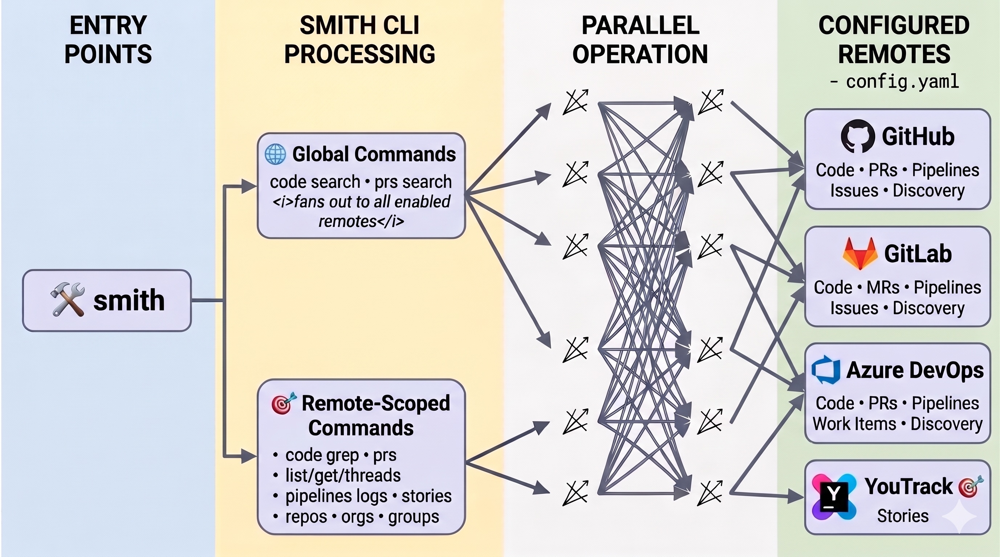

<div align="center">

# Smith

**The investigation CLI built for AI agents.**

One tool/skill to search code, grep files, inspect PRs, read pipelines, and track issues across GitHub, GitLab, Azure DevOps, and YouTrack — token-efficient, read-only, and agent-ready.

[](LICENSE)
[](https://www.python.org)
[](https://github.com/faustodavid/smith)

</div>

---

Smith is a read-only investigation CLI and AI tool. With a single command, it searches all your **remotes** code, greps files, and inspects PRs or pipelines across GitHub, GitLab, Azure DevOps, and YouTrack in parallel. Smith prioritizes efficiency, returning only the smallest useful result.
<div align="center">
  
</div>

## The Problem

AI coding agents need to investigate code across repositories and multiple remotes. The existing approach — provider-specific MCPs like the GitHub MCP — wasn't designed for this.

**Reading files is expensive.** Provider MCPs expose `get_file_contents`, which downloads the entire file. A Helm values file can be 2,000+ lines, but you only need the six lines under `resources.limits`. That's thousands of wasted tokens per read, and in an agentic loop, the agent may read dozens of files per investigation.

**There's no grep.** Without server-side regex, agents have to download a file, scan it themselves, and move on — burning context window on content that doesn't match. Multiply that across files and repos, and a simple question like *"where is the CPU limit set?"* becomes a slow, expensive sequence of full file reads.

**Cross-platform investigations don't exist.** If the answer spans a GitHub repo, a GitLab pipeline, and a YouTrack ticket, the agent needs three different tools with three different interfaces. Most MCPs only cover one provider.

## How Smith Solves It
### Crossed providers search

You can start broad with a content search acrossed all your configured remotes. It will fans out and returns compact `repo:/path` pointers, so then the agent knows where to drill in.

```bash
$ smith code search "auth middleware"
[github-public] matches: 3
infra-helm/src/auth/middleware.go
api-service/src/auth/middleware.ts
web-app/src/auth/middleware.rs

[gitlab-platform] matches: 2
acme/platform/api/src/auth/middleware.go
acme/platform/web/src/auth/middleware.ts

[gitlab-internal] matches: 3
acme/internal/auth/handler.go
acme/internal/services/authentication.rs
acme/internal/lib/auth.ts
```

This gives the model clear direction for the next step: targeted grep in the right repos.

### Grep instead of read

Smith implements `code grep` across **every provider** — GitHub, GitLab, and Azure DevOps — with regex, path scoping, glob filters, context lines, and line ranges.

```bash
smith github-public code grep infra-helm "resources:" --path charts/ --glob "*.yaml" --context-lines 5
```

Smith returns just the matching lines with surrounding context. The agent gets exactly what it needs in a fraction of the tokens.

### Grep pipeline logs too

The same grep workflow extends to CI/CD. Instead of downloading an entire build log, Smith lets agents search across all jobs or target a specific one:

```bash
smith github-public pipelines logs grep my-repo 12345 "error|fatal" --context-lines 3
smith azdo-main pipelines logs grep SRE 6789 "timeout" --log-id 42
```


## AI Skill

Smith was built for AI agents from the ground up. The `skills/smith/SKILL.md` file is a structured prompt document that gives any LLM-powered editor the full playbook:

- **Trigger decision** — when to reach for Smith vs. other tools
- **Complete command vocabulary** — every valid CLI path with correct argument shapes per provider
- **Investigation algorithm** — a deterministic broad-to-narrow workflow: discover scope → locate with search → extract proof with grep → corroborate with PRs/pipelines/stories → report with citations
- **Failure recovery** — specific handlers for 401/403, 429, truncation, empty results, and wrong-repo misses
- **Answer contract** — evidence-first format with exact path citations and a `Sources` section

Register `skills/smith/SKILL.md` as a skill in your editor — Windsurf, GitHub Copilot, Codex, Claude Code — and the agent drives Smith commands autonomously.

---

## Supported Providers

| Provider | Code Search | Code Grep | PRs / MRs | Pipelines | Issues / Stories | Discovery |
|:---------|:-----------:|:---------:|:---------:|:---------:|:----------------:|:---------:|
| **GitHub** | ✅ | ✅ | ✅ | ✅ | ✅ | orgs, repos |
| **GitLab** | ✅ | ✅ | ✅ | ✅ | ✅ | groups, repos |
| **Azure DevOps** | ✅ | ✅ | ✅ | ✅ | ✅ | orgs, repos |
| **YouTrack** | — | — | — | — | ✅ | — |

---

## Installation

### Prerequisites

- **git**
- **[uv](https://docs.astral.sh/uv/)**

### Install from GitHub

**macOS / Linux**:

```bash
curl -sSL https://raw.githubusercontent.com/faustodavid/smith/main/scripts/install.py | python3
```

**Windows (PowerShell)**:

```powershell
irm https://raw.githubusercontent.com/faustodavid/smith/main/scripts/install.py | python -
```

### Install from a local clone

```bash
python3 scripts/install.py
```

The installer keeps a managed Smith repo checkout at `~/.local/share/smith`, mirrors `skills/smith` into `~/.agents/skills/smith`, and installs the `smith` CLI with `uv` from the managed repo checkout.

### Update

```bash
python3 ~/.local/share/smith/scripts/install.py
```

### Verify

```bash
smith --help
```

The installer runs `uv tool update-shell` for you, but you may need to **restart your shell** (or open a new terminal) for PATH changes to take effect — especially on Windows, where `uv` writes the update to the user PATH in the registry.

---

## Quick Start

### 1. Initialize configuration

```bash
smith config init
```

### 2. Edit the config file

```bash
smith config path          # prints the path (~/.config/smith/config.yaml)
$EDITOR ~/.config/smith/config.yaml
```

Each remote gets a user-chosen name (like `github-public` or `azdo-main`) that you use as the first argument in provider-scoped commands:

```yaml
defaults:
  timeout_seconds: 30
  max_output_chars: 20000

remotes:
  github-public:
    provider: github
    org: acme
    token_env: GITHUB_TOKEN
    enabled: true

  gitlab-platform:
    provider: gitlab
    org: acme/platform
    token_env: GITLAB_TOKEN
    enabled: true

  azdo-main:
    provider: azdo
    org: acme
    enabled: true

  youtrack-main:
    provider: youtrack
    host: https://youtrack.acme.com
    token_env: YOUTRACK_TOKEN
    enabled: true
```

Override the config path with `SMITH_CONFIG=/path/to/config.yaml`.

For GitHub Enterprise, self-hosted GitLab, or YouTrack on a custom domain, add `host`:

```yaml
remotes:
  github-enterprise:
    provider: github
    org: platform
    host: github.acme.internal
    token_env: GITHUB_ENTERPRISE_TOKEN
    enabled: true

  gitlab-self-hosted:
    provider: gitlab
    org: platform/backend
    host: gitlab.acme.internal
    token_env: GITLAB_SELF_HOSTED_TOKEN
    enabled: true

  youtrack-self-hosted:
    provider: youtrack
    host: https://youtrack.acme.internal
    token_env: YOUTRACK_TOKEN
    enabled: true
```

> **YouTrack note:** Set `host` to the service root URL. Smith appends `/api` automatically. If your instance is mounted under a subpath, use the full base URL.

Manage remotes without editing the file:

```bash
smith config list                  # list all remotes and their status
smith config show github-public    # show details for one remote
smith config enable azdo-main      # enable a disabled remote
smith config disable azdo-main     # disable a remote without removing it
```

### 3. Set up authentication

Smith reads tokens from environment variables. Set them for your session or, better, store them in your OS keychain so they persist securely:

```bash
# macOS — store tokens in Keychain and load them automatically
security add-generic-password -a "$USER" -s "GITHUB_TOKEN" -w "ghp_..."
security add-generic-password -a "$USER" -s "GITLAB_TOKEN" -w "glpat-..."
security add-generic-password -a "$USER" -s "YOUTRACK_TOKEN" -w "perm:..."
```

Then add these lines to your shell profile (`~/.zshrc`, `~/.bashrc`, etc.):

```bash
export GITHUB_TOKEN=$(security find-generic-password -a "$USER" -s "GITHUB_TOKEN" -w 2>/dev/null)
export GITLAB_TOKEN=$(security find-generic-password -a "$USER" -s "GITLAB_TOKEN" -w 2>/dev/null)
export YOUTRACK_TOKEN=$(security find-generic-password -a "$USER" -s "YOUTRACK_TOKEN" -w 2>/dev/null)
```

Or just export them directly if you prefer:

```bash
export GITHUB_TOKEN="ghp_..."
export GITLAB_TOKEN="glpat-..."
export YOUTRACK_TOKEN="perm:..."
```

For Azure DevOps, authenticate with the Azure CLI:

```bash
az login
```

> **Tip:** On Linux, use `secret-tool` (libsecret) or `pass` instead of `security`. On Windows, use Credential Manager. The key idea is the same: keep tokens out of dotfiles and let your OS manage the secrets.

### 4. Start investigating

```bash
smith config list                                          # verify your remotes
smith code search "grafana"                                # search across all remotes
smith github-public code grep my-repo "TODO" --path src    # targeted grep
smith gitlab-platform repos --grep "^platform/"            # discover repos
smith youtrack-main stories search --query "patch rollout" # find issues
```

---

## CLI Reference

### Global commands

These work across all enabled remotes at once:

```bash
smith code search "<query>"                     # search code across every enabled remote
smith prs search "<query>"                      # search pull requests across every enabled remote
smith config <init|path|list|show|enable|disable>
smith cache clean [--remote <name>|--remote all]
```

### Remote-scoped commands

Prefix any command with a configured remote name to target a single provider:

#### Discovery

```bash
smith <remote> repos                            # list repositories
smith <remote> orgs                             # list orgs/projects (GitHub, Azure DevOps)
smith <remote> groups                           # list groups (GitLab only)
```

GitLab discovery supports `--grep`, `--skip`, and `--take` (default `50`, max `500`).

#### Code

```bash
smith <remote> code search "<query>"            # search code in one remote
smith <remote> code grep <repo> "<regex>"       # targeted grep in a repository
```

`code grep` supports `--path`, `--glob`, `--branch`, `--output-mode`, `--context-lines`, `--from-line`, `--to-line`, `--case-sensitive`, and `--no-clone`.

#### Pull Requests / Merge Requests

```bash
smith <remote> prs search "<query>"             # search PRs in one remote
smith <remote> prs list <repo>                  # list PRs
smith <remote> prs get <repo> <id>              # get PR details
smith <remote> prs threads <repo> <id>          # get review comments
```

`prs search` and `prs list` support `--status`, `--creator`, `--date-from`, `--date-to`, `--skip`, `--take`, `--exclude-drafts`, and `--include-labels`.

#### Pipelines

```bash
smith <remote> pipelines logs list <repo> <id>  # list logs for a pipeline run
smith <remote> pipelines logs grep <repo> <id> "<regex>"  # grep pipeline logs
```

`logs grep` supports `--log-id`, `--output-mode`, `--context-lines`, `--from-line`, `--to-line`, and `--case-sensitive`.

#### Stories & Issues

```bash
smith <remote> stories get <id>                 # get a work item / issue
smith <remote> stories search --query "<text>"  # search issues
smith <remote> stories mine                     # list my assigned items
```

`stories search` supports `--area` (except YouTrack), `--type`, `--state`, `--assigned-to`, `--skip`, and `--take`.

### Provider-specific argument shapes

| Provider | Repo argument | Example |
|:---------|:-------------|:--------|
| **GitHub** | bare `<repo>` (no org prefix) | `smith gh code grep my-repo "TODO"` |
| **GitLab** | full `group/project` path | `smith gl code grep acme/platform/api "TODO"` |
| **Azure DevOps** | `<project> <repo>` | `smith azdo code grep SRE my-repo "TODO"` |
| **YouTrack** | no repo — only issue IDs and search | `smith yt stories get RAD-1055` |

---

## Quality Gates And Benchmarks

Smith keeps three separate quality layers:

- `scripts/validate_skill_quality.py`
  - Validates the skill contract encoded in `skills/smith/SKILL.md`, `references/*`, and `tests/skills/smith/fixtures/*`.
- `scripts/run_skill_benchmark.py`
  - Runs capability evals against representative investigation tasks defined in `benchmarks/evals/smith_skill_cases.json`.
- `scripts/run_runtime_benchmark.py`
  - Measures CLI performance on fixed runtime scenarios defined in `benchmarks/runtime/scenarios.json`.

```bash
uv sync --extra bench

# Validate the skill contract/docs
uv run python scripts/validate_skill_quality.py --mode all

# Provide auth for capability benchmarks
export GITHUB_TOKEN="ghp_..."          # optional if `gh auth login` is configured
export OPENAI_API_KEY="sk-..."         # only for --executor openai
codex login                            # only for --executor codex

# Run capability evals with different executors
uv run python scripts/run_skill_benchmark.py --executor openai --model gpt-5 --runs 1
uv run python scripts/run_skill_benchmark.py --executor copilot --model gpt-5.4 --runs 1
uv run python scripts/run_skill_benchmark.py --executor codex --model gpt-5.4 --runs 1

# Run runtime/performance benchmarks
uv run python scripts/run_runtime_benchmark.py --runs 3 --write-json benchmarks/runtime/baselines/local.json
```

Capability benchmark outputs land in `benchmarks/workspaces/<timestamp>/` and include `benchmark.json`, `benchmark.md`, per-run transcripts, timing data, grading artifacts, and auditable tool traces.

Checked-in benchmark assets live under `benchmarks/evals/` and `benchmarks/runtime/`. Generated capability benchmark outputs stay under `benchmarks/workspaces/`, which is gitignored.

The Codex capability benchmark executor creates an isolated `CODEX_HOME` and copies your `auth.json` from `~/.codex` (or `CODEX_AUTH_HOME`) so it never modifies your real desktop configuration.

---

## License

[MIT](LICENSE)
