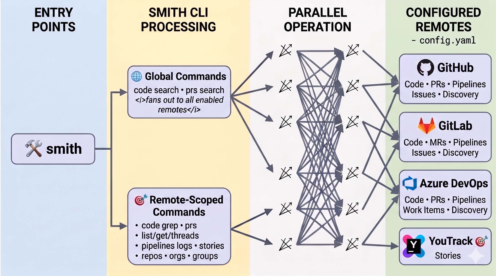

<div align="center">

# Smith

**Let your AI coding agent investigate code anywhere — without cloning, and without write access.**

One CLI to search code, grep exact lines, inspect PRs, scan CI logs, and look up
issues across **GitHub**, **GitLab**, **Azure DevOps**, and **YouTrack**.

[](LICENSE)
[](https://www.python.org)
[](https://github.com/faustodavid/smith/actions/workflows/ci.yml)
[](https://github.com/faustodavid/smith)



</div>

## What is Smith?

AI coding agents are great at answering questions about the repo in front of
them — and blind to everything else. The answer to "why did CI fail?" or "which
repos still use this dependency?" usually lives in *other* repos, PR threads,
pipeline logs, or an issue tracker.

Smith fixes that. It gives your agent **read-only eyes on all your remotes**, so
it can answer questions like:

- 🔍 *Where is this setting defined?*
- 📦 *Which repos still use this dependency?*
- 🔀 *What changed in this PR, and what did reviewers say?*
- 🚦 *Why did this pipeline fail?*
- 📋 *Is there an issue or story that explains this work?*

…and it does so without cloning repos, downloading whole files, or juggling
provider-specific tools.

### Why teams like it

| | |
|---|---|
| 🪶 **Token-efficient** | Returns search hits and grep-sized context windows, not full files. Built for LLM context budgets. |
| 🔄 **One workflow, four providers** | The same verbs (`code search`, `code grep`, `prs`, `pipelines`, `stories`) work on GitHub, GitLab, Azure DevOps, and YouTrack. |
| 🔒 **Read-only by contract** | There are no create, update, approve, comment, or post commands. Smith cannot change anything. |
| 🔑 **Your credentials stay local** | Tokens live in your environment, OS keychain, or provider CLI login. Smith is not a hosted proxy. |

Think of it as a provider MCP (like the GitHub MCP) reimagined for one job:
fast, cross-remote, evidence-first investigation.

## Quick Start

### 1. Install

macOS / Linux (recommended):

```bash
brew install faustodavid/tap/smith
```

<details>
<summary>Other install options (standalone installer, Windows)</summary>

The installer requires `uv`, `git`, and `rg` (ripgrep).

Standalone installer:

```bash
curl -sSL https://raw.githubusercontent.com/faustodavid/smith/main/scripts/install.py | python3
```

Windows PowerShell:

```powershell
irm https://raw.githubusercontent.com/faustodavid/smith/main/scripts/install.py | python -
```

</details>

### 2. Connect your remotes

```bash
smith config init
```

This starts a guided onboarding flow: it scans for existing provider auth
(`gh`, `glab`, `az`, env vars), helps you add remotes, and stores pasted tokens
in your OS secure credential store — never in the config file.

### 3. Let your agent use it

`smith config init` also installs the **Smith agent skill** to
`~/.agents/skills/smith`, which teaches your AI agent how to investigate:
search broad, grep for exact proof, then corroborate with PRs, pipelines, or
issues. The skill keeps itself current after upgrades (set
`SMITH_SKILL_CHECK=0` to opt out, or run `smith skill sync` to refresh
manually).

That's it — ask your agent a question that spans repos and watch it work.

## What an Investigation Looks Like

These are the moves the Smith skill teaches your agent (and they work just as
well typed by hand). Examples assume remotes named `github-public`,
`gitlab-platform`, `azdo-main`, and `youtrack-main`.

### Find where something lives

Start broad across all enabled remotes, then grep the likely repo for exact
proof:

```bash
# Broad: search every remote at once
smith code search "auth middleware" --take 30
smith code search "python==3.10" --glob "pyproject.toml"

# Narrow: grep one repo for the exact lines
smith github-public code grep api-service "timeout_seconds" --path src --context-lines 2
smith gitlab-platform code grep acme/platform/api "resources:" --glob "*.yaml" --context-lines 5
```

Map a subtree before reading matches:

```bash
smith github-public code grep api-service ".*" --path src/auth --output-mode files_with_matches
```

### Understand a PR

```bash
smith prs search "auth middleware" --status active --exclude-drafts
smith github-public prs list api-service --status active
smith github-public prs get api-service 123
smith github-public prs threads api-service 123   # review comments
```

### Debug a failing pipeline

List the run first, then grep the logs — never dump entire job output:

```bash
smith github-public pipelines list api-service 123456789
smith github-public pipelines grep api-service 123456789 "error|fatal|Traceback" --reverse --context-lines 3

# Target one job or log when needed
smith azdo-main pipelines grep SRE 6789 "timeout" --log-id 42 --context-lines 3
```

### Look up issues and stories

One shape across all four providers:

```bash
smith github-public stories search api-service --query "rate limit"
smith gitlab-platform stories search acme/platform/api --query "migration rollback"
smith youtrack-main stories search --query "patch rollout" --state Open
smith youtrack-main stories get RAD-1055
```

### How each provider names a repo

The only per-provider difference to remember:

| Provider | Repo argument shape | Example |
|---|---|---|
| GitHub | bare repo name | `smith gh code grep api-service "TODO"` |
| GitLab | full group/project path | `smith gl code grep acme/platform/api "TODO"` |
| Azure DevOps | project, then repo | `smith azdo code grep SRE api-service "TODO"` |
| YouTrack | issue IDs and queries only | `smith yt stories get RAD-1055` |

## Supported Providers

| Provider | Code search | Code grep | PRs / MRs | Pipelines | Issues / stories | Discovery |
|---|---:|---:|---:|---:|---:|---:|
| GitHub | ✅ | ✅ | ✅ | ✅ | ✅ | Orgs, repos |
| GitLab | ✅ | ✅ | ✅ | ✅ | ✅ | Groups, repos |
| Azure DevOps | ✅ | ✅ | ✅ | ✅ | ✅ | Orgs, repos |
| YouTrack | — | — | — | — | ✅ | — |

## Configuration

To change remotes later, run `smith config edit`, or edit the file directly:

```bash
smith config path
$EDITOR ~/.config/smith/config.yaml
```

Minimal config shape:

```yaml
defaults:
  timeout_seconds: 30
  max_output_chars: 20000

remotes:
  github-public:
    provider: github
    org: acme
    enabled: true

  gitlab-platform:
    provider: gitlab
    org: acme/platform
    enabled: true

  azdo-main:
    provider: azdo
    org: acme
    enabled: true

  youtrack-main:
    provider: youtrack
    host: https://youtrack.acme.com
    enabled: true
```

Set `SMITH_CONFIG=/path/to/config.yaml` when a workspace needs a different
config file. To create an empty config for manual editing, use
`smith config init --manual` (or `--format json` for noninteractive
automation).

<details>
<summary><strong>How authentication resolves per provider</strong></summary>

- `smith config show <remote>` prints the persisted remote fields only. If
  `token_env` is absent, Smith may still authenticate through the runtime
  fallbacks below.
- `token_env` is optional when a provider has an implicit env fallback or CLI
  login. Add it when you want Smith to read a specific environment variable or
  secure-store entry.
- **GitHub:** configured env/secure-store token → public GitHub's implicit
  `GITHUB_TOKEN` → host-scoped `gh auth token`. GitHub Enterprise uses
  host-scoped `gh` auth unless you configure `token_env`.
- **GitLab:** configured env/secure-store token → implicit `GITLAB_TOKEN` →
  host-scoped `glab config get token`.
- **Azure DevOps:** configured `AZURE_DEVOPS_PAT` env/secure-store PAT when
  `token_env` is set, otherwise `az login` / Azure DefaultAzureCredential.
- **YouTrack:** configured env/secure-store token, or implicit
  `YOUTRACK_TOKEN` when `token_env` is omitted.

</details>

## Troubleshooting

| Symptom | What to do |
|---|---|
| `401` / `403` | Check `smith config show <remote>`. If the remote has `token_env`, set that env var or store a token with `smith config edit`. Otherwise check implicit env vars (`GITHUB_TOKEN`, `GITLAB_TOKEN`, `YOUTRACK_TOKEN`) and refresh provider login: `gh auth login`, `glab auth login --hostname <host>`, or `az login`. |
| `429` rate limited | Lower `--take`, narrow `--path` or `--glob`, or reduce GitHub grep workers with `GITHUB_GREP_MAX_WORKERS`. |
| Truncated output | Reduce `--context-lines`, narrow the path, or page with `--from-line` and `--to-line`. |
| Empty results | Broaden the search query, then grep candidate repos again. |

## Development

```bash
uv sync --extra dev
make check
```

Useful quality gates:

```bash
uv run --extra dev python scripts/validate_skill_quality.py --mode all
uv run --extra dev pytest tests/unit tests/contract -q
```

## Status

Smith is alpha software. The goal is a stable, read-only investigation contract
for AI agents, but command details may still change while the project hardens.

## License

[MIT](LICENSE)
